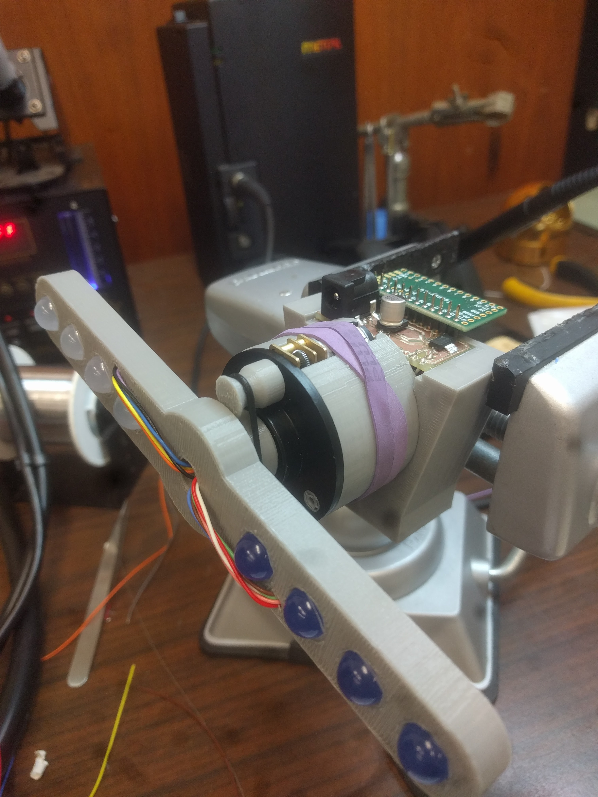

# Feedback Strobe

Feedback strobe is a technology demonstration aid for EE422G Signals and Systems Laboratory at the University of Kentucky. Commisioned by [Dr. Kevin Donohue](https://www.engr.uky.edu/research/researchers/kevin-donohue/), the device will allow students to use LabView to monitor and control motor rotation speed, with the goal of tuning it such that strobing LEDs will 'stand still'

The initial assembly of all printed parts and a populated revision 1 PCB can be seen below. All printing done on a MakerBot Replicator 5th Gen. The rubber band keeps tension on o-ring acting as a pulley.

Here are the parts:
- http://www.digikey.com/product-detail/en/on-semiconductor/MC78M05CDTRKG/MC78M05CDTRKGODKR-ND/1140087
- http://www.digikey.com/product-detail/en/vishay-siliconix/IRFL9110TRPBF/IRFL9110PBFCT-ND/812532
- http://www.digikey.com/product-detail/en/cui-inc/PJ-002AH-SMT-TR/CP-002AHPJCT-ND/669692
- http://www.digikey.com/product-detail/en/nichicon/UWT1C221MCL1GS/493-2179-1-ND/590154
- http://www.digikey.com/product-detail/en/triad-magnetics/WSU090-1300/237-1451-ND/3094977
- https://www.sparkfun.com/products/9453
- https://www.sparkfun.com/products/13305
- https://www.sparkfun.com/products/12316
- https://www.sparkfun.com/products/12248
- https://www.sparkfun.com/products/10635
- https://www.sparkfun.com/products/11121
- https://www.sparkfun.com/products/13065
- https://www.sparkfun.com/products/116
- https://www.sparkfun.com/products/553
