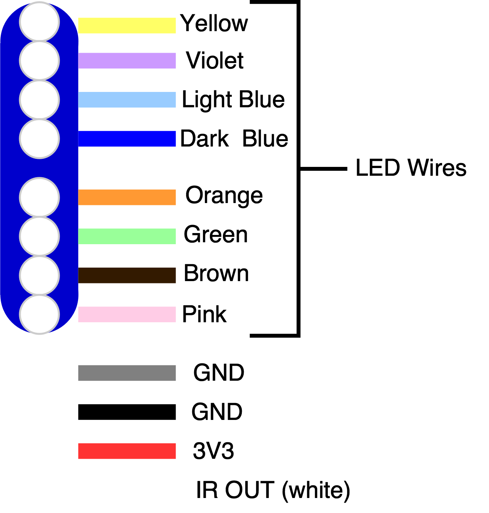
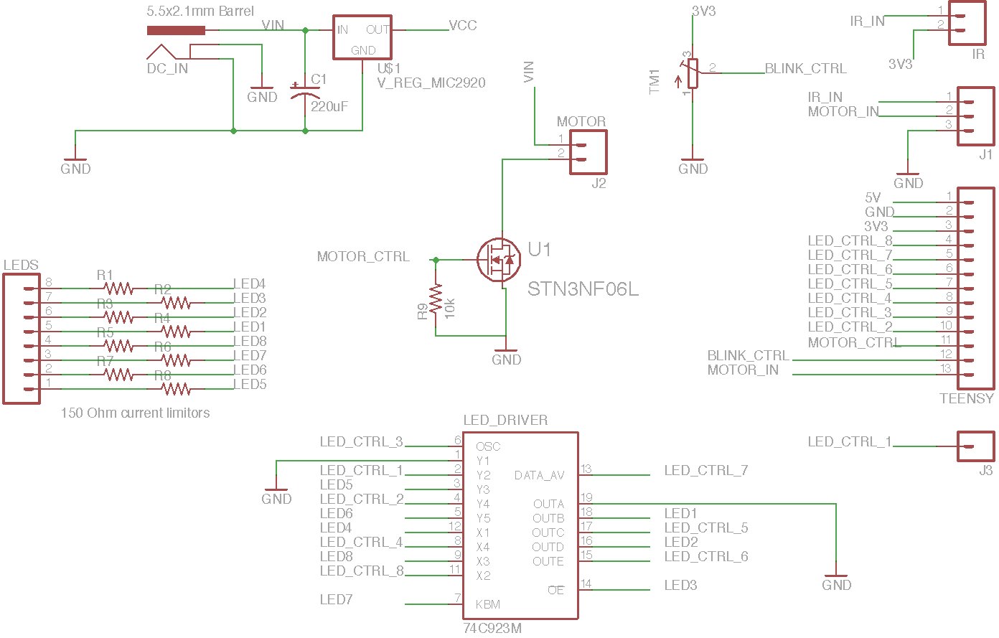

# Feedback Strobe

Feedback strobe is a technology demonstration aid for EE422G Signals and Systems Laboratory at the University of Kentucky. Commisioned by [Dr. Kevin Donohue](https://www.engr.uky.edu/research/researchers/kevin-donohue/) and [Dr. Michael Johnson](https://www.engr.uky.edu/research/researchers/michael-t-johnson/), the device facilitate hands on involvement in many aspects of a persistence of vision project. The students will be tasked with programming an ARM microcontroller using the Arduino IDE to control both rotation and blink speed of the device to produce the illusion of the lights blinking in place.


## Lab Procedure

First, the leads of the LED must be mapped to Teensy pin numbers. The Figure below shows the color coding of the slip ring wires.



There is an [analog reflectance sensor](https://www.sparkfun.com/products/9453) on the underside of the propellor who's signal (the white slip ring wire) varies upon rotation of the propellor. The white pulley on the motor shaft provides a high reflectance surface causing the output of the IR reflectance sensor to decrease. Thus, the analog signal will have local minima upon completion of a rotation.

Tracking this speed via periodic ADC operations will yield a rotation speed. This value, in Hz, corresponds to the frequency (or a harmonic threof) at which you must drive the GPIO pins connected to the LEDs. This way, no matter the speed of the motor, they will always be blinking in place!


### Physical Design
All structural parts in the Feedback Strobe were designed in Autodesk Inventor and printed on a 5th gen MakerBot Replicator (PLA filament). A slip ring is used to commutate both rotation speed and LED control signals. A LED-bar, the 'propellor' like part, was designed to hold the LEDs and IR reflectance sensor in place, to be driven by a motor with a pulley.

All CAD models can be viewed on GitHub by accessing the ```.stl``` files in the ```cad/stl/``` [directory](https://github.com/ruffner/feedback-strobe/tree/master/cad/stl).


An o-ring is used as the pulley. The 900 RPM micro-gear motor from Sparkfun was aligned such that its shaft would fit through one of the mounting holes of the slip ring. LED and IR sensor wires are routed through the center of the LED-bar, then through to the back side and attached.


The color-coded wires from the slip ring are then attached to the custom PCB, which hosts an LED buffer/driver, current limiting resistors for the LEDs, as well as a 5v regulator and motor control N-channel MOSFET. It also has a row of headers that line up with one side of the microcontroller, the Teensy-LC.


### Schematic and PCB

Data sheets for ICs used are in the ```docs/``` folder.




Finished v2.1 PCB:


### In Action
Although the software is not quite finished, here is a picture of it while in motion.


The following scope traces are of the IR reflectance sensor output while rotating at full speed. The 'valleys' in the signal occur when the IR reflectance sensor in the LED-bar pass over the drive pulley attached to the motor. The tip of the drive pulley could be covered in a more reflective material (e.g. white paper or whiteout) to dramaticize the change in signal. 

This shows the interval between valleys, representing the rotation period.


This shows the voltage difference between the valley minimum and average when not in a valley.


### Parts
In the ```docs``` folder, [here](docs/Feedback Strobe Parts List.pdf)
