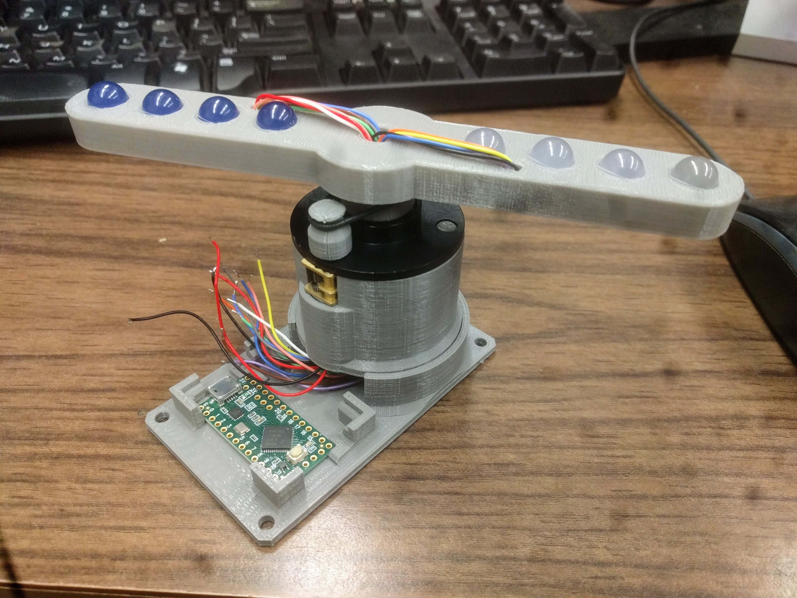

# Feedback Strobe

Feedback strobe is a technology demonstration aid for EE422G Signals and Systems Laboratory at the University of Kentucky. Commisioned by [Dr. Kevin Donohue](https://www.engr.uky.edu/research/researchers/kevin-donohue/), the device will allow students to use LabView to monitor and control motor rotation speed, with the goal of tuning it such that strobing LEDs will 'stand still'

### Plan of Operation
A flow chart of the proposed operation can be seen below.

### Current Design
The second generation body design can be seen below. Support was added to the motor mount to eliminate the need for the tensioning rubberband. The main base was also modified so that the device is self-supported.

Another PCB revision is in the works, with dimensions of 40mm x 30mm, it will sit in the notches above the mounted TennsyLC seen in the picture below. It will feature an 8 bit buffer to drive the LEDs, along with an updated N-channel MOSFET for motor speed control. 

### Previous Design
The initial assembly of all printed parts and a populated v1 PCB can be seen below. All printing done on a MakerBot Replicator 5th Gen. The rubber band keeps tension on o-ring acting as a pulley.

Here are the parts:
- http://www.digikey.com/product-detail/en/on-semiconductor/MC78M05CDTRKG/MC78M05CDTRKGODKR-ND/1140087
- http://www.digikey.com/product-detail/en/vishay-siliconix/IRFL9110TRPBF/IRFL9110PBFCT-ND/812532
- http://www.digikey.com/product-detail/en/cui-inc/PJ-002AH-SMT-TR/CP-002AHPJCT-ND/669692
- http://www.digikey.com/product-detail/en/nichicon/UWT1C221MCL1GS/493-2179-1-ND/590154
- http://www.digikey.com/product-detail/en/triad-magnetics/WSU090-1300/237-1451-ND/3094977
- https://www.sparkfun.com/products/9453
- https://www.sparkfun.com/products/13305
- https://www.sparkfun.com/products/12316
- https://www.sparkfun.com/products/12248
- https://www.sparkfun.com/products/10635
- https://www.sparkfun.com/products/11121
- https://www.sparkfun.com/products/13065
- https://www.sparkfun.com/products/116
- https://www.sparkfun.com/products/553
