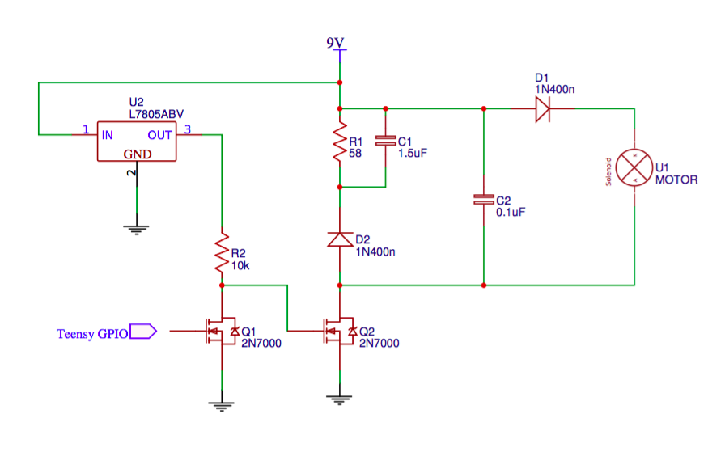

# Feedback Strobe

Feedback strobe is a technology demonstration aid for EE422G Signals and Systems Laboratory at the University of Kentucky. Commisioned by [Dr. Kevin Donohue](https://www.engr.uky.edu/research/researchers/kevin-donohue/) and [Dr. Michael Johnson](https://www.engr.uky.edu/research/researchers/michael-t-johnson/), the device facilitate hands on involvement in many aspects of a persistence of vision project. The students will be tasked with programming an ARM microcontroller using the Arduino IDE to control both rotation and blink speed of the device to produce the illusion of the lights blinking in place.

## Lab Procedure

### Step 1: LED and IR Sensor Setup
First, the leads of the LED must be mapped to Teensy pin numbers. The Figure below shows the color coding of the slip ring wires.

There is an [analog reflectance sensor](https://www.sparkfun.com/products/9453) on the underside of the propellor who's signal (the white slip ring wire) varies upon rotation of the propellor. The white pulley on the motor shaft provides a high reflectance surface causing the output of the IR reflectance sensor to decrease. Thus, the analog signal will have local minima upon completion of a rotation.

Tracking this speed via periodic ADC operations will yield a rotation speed. This value, in Hz, corresponds to the frequency (or a harmonic threof) at which you must drive the GPIO pins connected to the LEDs. This way, no matter the speed of the motor, they will always be blinking in place!

Now would be a good time to play with driving the LEDs and reading the analog voltage from the IR sensor with some Teensy code. 

Demonstrate that the reflectance voltage is least when over the drive pulley. Show that all of the LEDs can be turned both on and off.

### Step 2: Back EMF Protection Circuit

The schematic below shows the ciruit to build to interface with the motor.

## Reference 
This is not part of the instructional lab, just historical information on the construction of the device.

